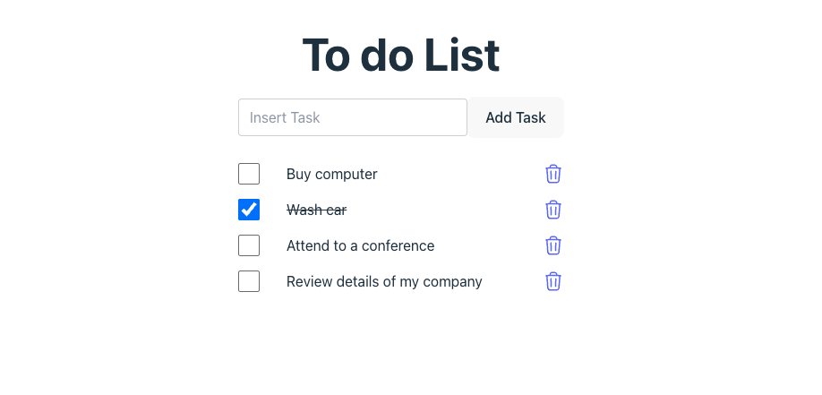

# 📝 To-Do List App

A To-Do List app built with React. Users can add, delete, and mark tasks as completed. The app demonstrates fundamental React concepts like state management, component hierarchy, and props communication.



## 🚀 Features

- ✅ Add new tasks
- ❌ Delete tasks
- 🔁 Mark tasks as completed/uncompleted

## 🛠️ Tech Stack

- React
- Tailwind
- JavaScript

## 📦 Installation

Clone the repo and install dependencies:

```bash
git clone https://github.com/gianvallejos92/todolist-react.git
cd todo-list
npm install
npm run dev
